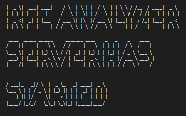
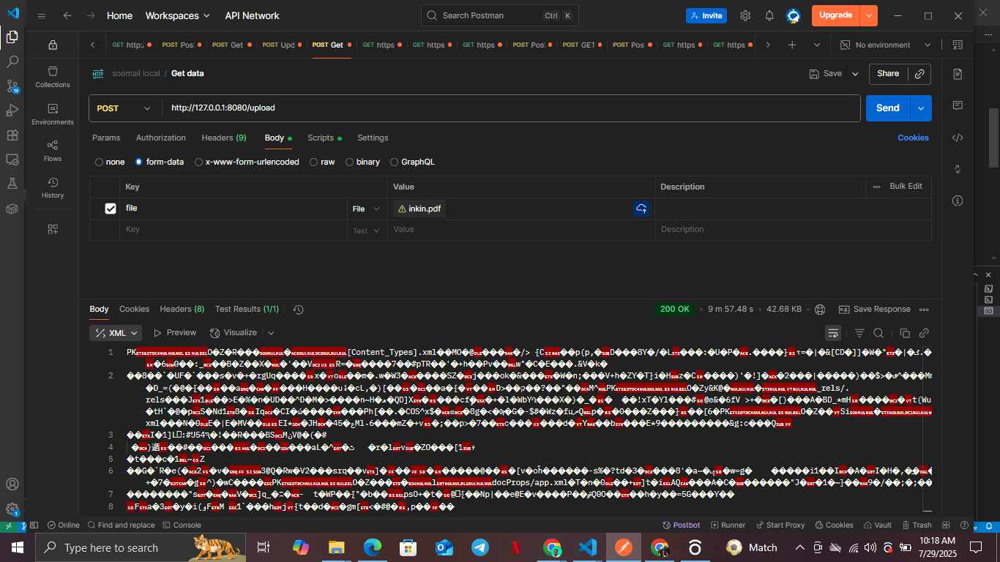

# How to run the VisaCompanion RFE Analyzer

- Unzip the file
- Navigate to the working directory

```console
cd visacompanion
```
- Create a virtual environment
```python
python -m venv myenv
```
- Install the project dependencies
```python
pip install -r requirements.txt
```
- Start the Server in Development Mode
```console
vicorn fastApp:app --reload --port 8080
```
- After running the above code, the below indicator will display in your CLI:
 


- Open any API CLient of your choice (POSTMAN preferably) and send a GET request to test if the server is actually active
```console
GET http://127.0.0.1:8080
```
- The response of the GET request above is:
```json
{"status": "successful", "response": "You are welcome to the server!"}
```
- Now for the main work, send a POST request to this endpoint, having a key of 'file' and the value should be the EB-1A petition you want to analyze.
```console
POST http://127.0.0.1:8080/upload
```
- Below is the response of that post request:



- After response is received, Click the "Save Response" button (top right of response panel).

- Select "Save to a file", and the Analysis Word Document will be downloaded to your machine.

# Using Docker instead
- After Unziping the file and navigating to the working directory, execute this command below in your CLI to build a custom docker image from the dockerfile.

```console
docker build -d visacomRFE:latest .

```
- After the image, run the container using this command.

```console
docker run -p 8080:8080 visacomRFE:latest
```
- Open any API CLient of your choice (POSTMAN preferably) and send a GET request to test if the server is actually active
```console
GET http://127.0.0.1:8080
```
- The response of the GET request above is:
```json
{"status": "successful", "response": "You are welcome to the server!"}
```
- Now for the main work, send a POST request to this endpoint, having a key of 'file' and the value should be the EB-1A petition you want to analyze.
```console
POST http://127.0.0.1:8080/upload
```
- Below is the response of that post request:


- After response is received, Click the "Save Response" button (top right of response panel).

- Select "Save to a file", and the Analysis Word Document will be downloaded to your machine.
